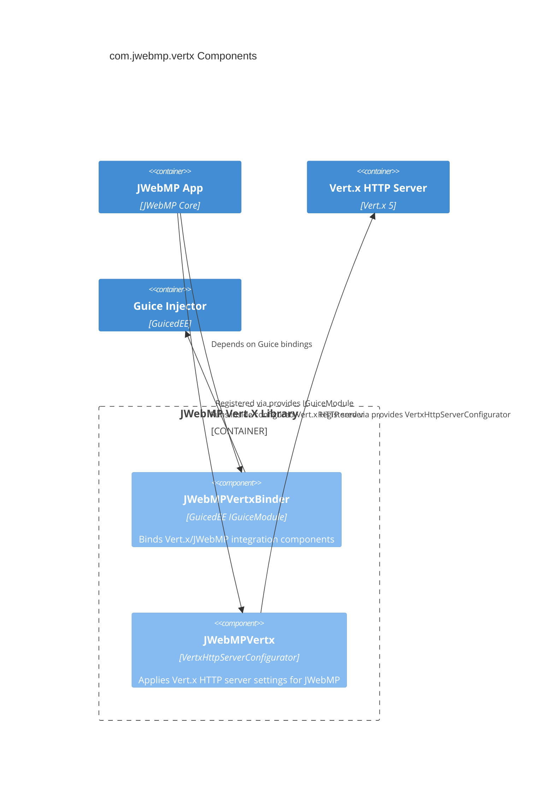

# C4 Level 3 — Vert.x Bridge Components

Focus on the `com.jwebmp.vertx` module that provides Guice bindings and Vert.x HTTP configuration.

Sources: `module-info.java` exports `JWebMPVertx` and `JWebMPVertxBinder`. Implementation internals are not present in the repository; update when classes are added.
