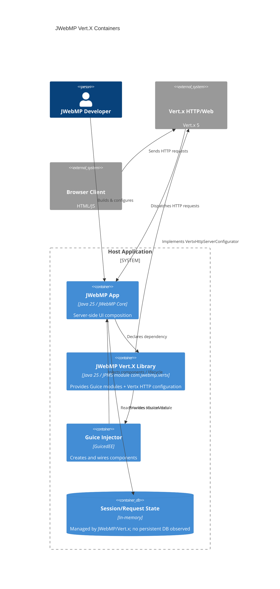

# C4 Level 2 — Containers

```mermaid
C4Container
    title JWebMP Vert.X Containers

    Person(dev, "JWebMP Developer")

    System_Boundary(app, "Host Application") {
        Container(webapp, "JWebMP App", "Java 25 / JWebMP Core", "Server-side UI composition")
        Container(bridge, "JWebMP Vert.X Library", "Java 25 / JPMS module com.jwebmp.vertx", "Provides Guice modules + Vertx HTTP configuration")
        Container(guice, "Guice Injector", "GuicedEE", "Creates and wires components")
        ContainerDb(state, "Session/Request State", "In-memory", "Managed by JWebMP/Vert.x; no persistent DB observed")
    }

    System_Ext(vertx, "Vert.x HTTP/Web", "Vert.x 5", "Event-loop & routing")
    System_Ext(browser, "Browser Client", "HTML/JS", "Consumes rendered UI")

    Rel(dev, webapp, "Builds & configures")
    Rel(webapp, bridge, "Declares dependency")
    Rel(bridge, guice, "Provides IGuiceModule")
    Rel(bridge, vertx, "Implements VertxHttpServerConfigurator")
    Rel(guice, webapp, "Injects components / lifecycle")
    Rel(vertx, webapp, "Dispatches HTTP requests")
    Rel(browser, vertx, "Sends HTTP requests")
    Rel(webapp, state, "Reads/writes session data")
```

Assumptions: No persistent storage is present; session/request state is transient. Update when concrete persistence or messaging modules are added.
