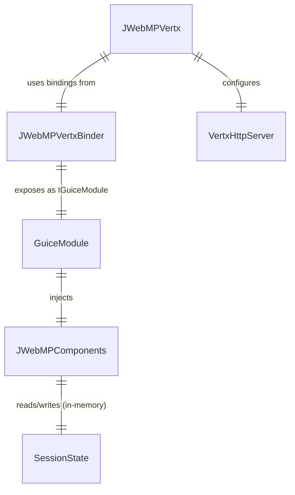

# ERD — Runtime Wiring (No Persistent Storage Observed)

No database schemas are present. The diagram captures runtime configuration objects inferred from `pom.xml` dependencies and JPMS providers in `module-info.java`.

Update this ERD when concrete entities or persistence models are added.
