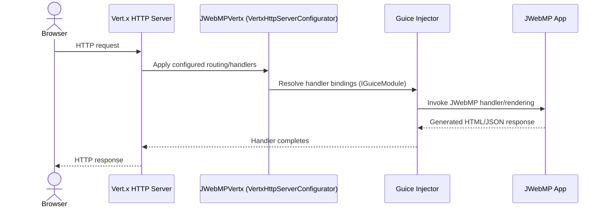

# Sequence — HTTP Request Handling

```mermaid
sequenceDiagram
    actor Browser
    participant Vertx as Vert.x HTTP Server
    participant Config as JWebMPVertx (VertxHttpServerConfigurator)
    participant Injector as Guice Injector
    participant App as JWebMP App

    Browser->>Vertx: HTTP request
    Vertx->>Config: Apply configured routing/handlers
    Config->>Injector: Resolve handler bindings (IGuiceModule)
    Injector->>App: Invoke JWebMP handler/rendering
    App-->>Injector: Generated HTML/JSON response
    Injector-->>Vertx: Handler completes
    Vertx-->>Browser: HTTP response
```

Based on service registrations declared in `module-info.java`; concrete route handlers are not visible in this repository.
