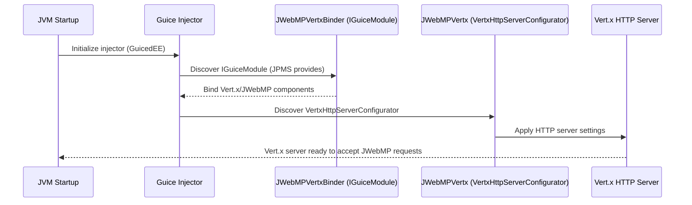

# Sequence — Startup and Bootstrapping

```mermaid
sequenceDiagram
    participant Runtime as JVM Startup
    participant Guice as Guice Injector
    participant Binder as JWebMPVertxBinder (IGuiceModule)
    participant Config as JWebMPVertx (VertxHttpServerConfigurator)
    participant Vertx as Vert.x HTTP Server

    Runtime->>Guice: Initialize injector (GuicedEE)
    Guice->>Binder: Discover IGuiceModule (JPMS provides)
    Binder-->>Guice: Bind Vert.x/JWebMP components
    Guice->>Config: Discover VertxHttpServerConfigurator
    Config->>Vertx: Apply HTTP server settings
    Vertx-->>Runtime: Vert.x server ready to accept JWebMP requests
```

Lifecycle derived from JPMS service providers in `module-info.java`.
